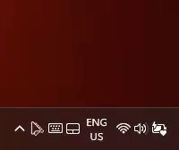

# CurHide

A simple windows utility to hide your mouse cursor on demand

---

---

### Features:

- Shortcut to hide the cursor
  
  - (Default is <kbd>Windows</kbd> + <kbd>Alt</kbd> + <kbd>Right Click</kbd>)

- Tray Icon
  
  - Easily hide your cursor by clicking on it or though the context menu
  
  - Quick access to the config file

- Unhide on Move and Freeze Cursor
  
  - Automatically unhide the cursor when you move your mouse
  
  - Lock the cursor in place until shortcut is pressed again
  
  - Shortcut variations for quick access (You press the shortcut with the global / main shortcut)
    
    - (Default is <kbd>Z</kbd> for Unhide on Move and <kbd>X</kbd> for Freeze Cursor)
  
  - These are easily configurable in the config file

- Extremely Lightweight
  
  - Only 244 lines of code!*
    
    ###### *as of v1.0.0

---

#### This program runs on [Nomousy](#about-nomousy)

---

### Installation

This app is **portable,** so you do not need to mess around with installers and residue files.

1. Download the [latest release](https://github.com/FractalScripts/cursor-hide/releases)

2. Extract the `.zip` file

3. Place the folder somewhere safe (Keeping it in downloads is not the best idea)

4. Run **CurHide**
   
   - Windows SmarScreen might pop up. This is normal, as this is *unsigned software*, but it is **completely safe** as long as you got it from the [official repository](https://github.com/FractalScripts/cursor-hide)
   
   - To bypass it, click <u>More info</u> and **Run anyway**

5. A tray icon should appear. If you do not see it check the hidden icons menu. (That's the little arrow in your tray that has more icons inside of it)

6. Try it! Press <kbd>Windows</kbd> + <kbd>Alt</kbd> + <kbd>Right Click</kbd>, your cursor should disappear!
   
   - Move your mouse or press the shortcut again to get your cursor back

7. Right click the tray icon and open the **configuration file** for more settings

---

### How to make CurHide run on startup

This way you do not need to run the app every time you restart your computer just to hide your cursor

1. <kbd>Right Click</kbd> **CurHide.exe**, click **Show more options** if you are on Windows 11, and click **Create shortcut**

2. Press <kbd>Windows</kbd> + <kbd>R</kbd>, type in `shell:startup` and hit <kbd>Enter</kbd>

3. **Copy and Paste** the shortcut into this folder

4. Open **Task Manager** (<kbd>Ctrl</kbd> + <kbd>Shift</kbd> + <kbd>Escape</kbd>)

5. On the left side, click **Startup apps**

6. You should find `CurHide.exe` in this list

---

### About Nomousy

Nomousy is a terminal program used to hide the mouse cursor

[Nomousy download](https://www.sindenwiki.org/wiki/Nomousy)

[How it works](https://www.autohotkey.com/board/topic/2083-nomousy-disablehide-your-mouse-pointer-cmd/)
